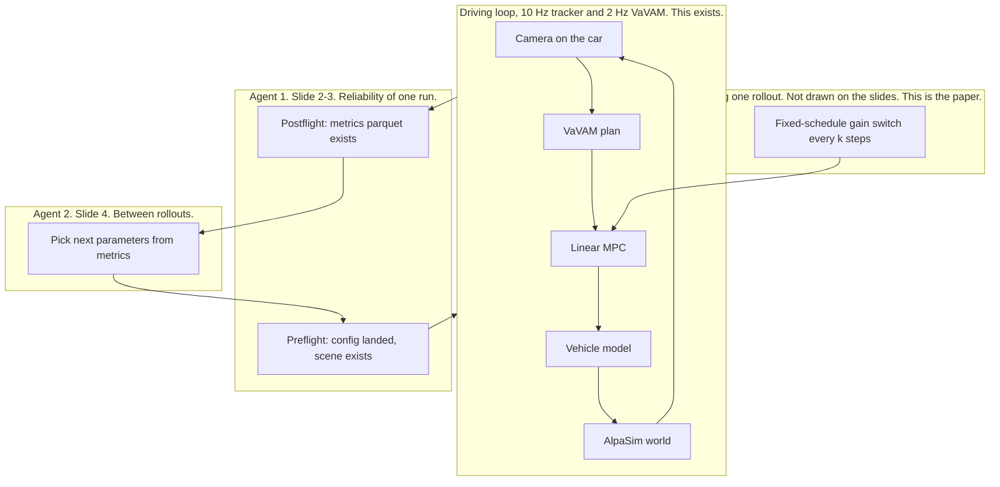

# Project map

As of 2026-09-22. This is the translation between Shao's slides, the code, and the
paper that can exist by 15 November.

## The paper, in one paragraph

An end-to-end driving stack is a tracker following a reference that a neural policy
computes from a camera bolted to the car. Classical switched-MPC dwell time assumes
that reference is an outside signal. Here it is not: a gain switch moves the car, the
camera moves, VaVAM emits a different plan, and the tracker chases the new plan. The
paper measures whether a switch that is safe under an exogenous reference becomes
unsafe once that camera loop is closed, and what extra dwell is required. The plant
is the **linear MPC**, because its cost can change between solves and because a
Riccati terminal cost gives a per-mode Lyapunov candidate. The policy is VaVAM. The
switcher in the paper is a script with a fixed schedule. An LLM, if it appears at
all, is a later outer loop that is not allowed to violate the dwell constraint the
script already measured.

Working title, from `paper-switching-stability.md`: *Switching Stability of
Supervisory Tracking Control for End-to-End Autonomous Driving with Endogenous
Neural References*. Six pages will not fit that title's full argument. The version
that fits is: the dwell gap, one figure of instability versus switching interval,
and the frozen-perception ablation that shows the gap shrinks when the camera loop
is cut. IV 2027 topics this sits under: Motion Planning and Intelligent Vehicle
Control, End-to-End Driving Systems, Collision Avoidance and Formal Safety Guarantees.
Call for papers: https://ieee-iv.org/2027/contributions/call-for-papers/

## Where Shao's diagram fits

`source/diagrams.pdf` is four slides, University of Georgia, made 2026-09-22. The
scientific question printed on slide 1 is:

> How can a hierarchical feedback-control architecture simultaneously ensure reliable
> AI-agent execution and sample-efficient experiment adaptation?

That is the **lab**, not the theorem. The slides draw two loops. The car has three.
Getting these confused is how an agent implements the wrong thing.

Agent 1 is a checklist with teeth: refuse to launch if the Hydra override did not
reach `runtime.simulation_config`, and mark the run failed if no metrics parquet was
written. The historical harness got both of those wrong (regex read the wrong
`planner_delay_us`; 60 of 272 runs wrote nothing). Griffin plus `RUNBOOK.md` is
Agent 1. It does not need a language model.

Agent 2 is the experiment controller \(C_{\exp}\): look at metrics, choose the next
parameter vector. The Optuna, random, and LoRA scripts are early attempts at Agent 2
aimed at finding crashes. That aim was rejected. With an ~80% nominal collision rate
there is no search problem, and Poirot, DVCA, and CF-RCA already do module-level
blame on stacks that have modules. See `researchideas.md` §0 and §1. Agent 2 comes
back only after the dwell boundary is measured, as a way to spend fewer rollouts
walking that boundary. It is not the November paper.

Slide 1 labels the box "Controller θ (VaVAM)". In this repo VaVAM is the reference
generator and the controller is the MPC in `src/controller`. An agent that "tunes the
controller" by editing the driver config is editing the wrong block.

## Symbol table

The slides reuse letters. Use these meanings in notes and code comments.

| Symbol on the slides | Slide | Means there | Means in this repo |
|---|---|---|---|
| θ | 1 | "Controller", drawn as VaVAM | Do not use. Say `driver` or `controller`. |
| φ | 1 | Vehicle model | `src/physics`, the vehicle model inside the controller service |
| ψ | 1 | World, AlpaSim | The scene plus traffic. Traffic for new runs is `trafficsim=catk`. |
| θ | 2–4 | World, and also the experiment parameter vector θⱼ | Collision. Call experiment parameters `schedule`, `gains`, `scene`. |
| xₖ | 2–3 | Discrete experiment state: IDLE, CONFIGURED, RUNNING, PAUSED, COMPLETED, FAULTED | A run directory either has `aggregate/metrics_results.txt` or it does not. |
| ξⱼ | 2–4 | Ego and world trajectories | `rollout.asl` plus the controller CSV |
| rⱼ | 2–4 | Experiment request: track, lane change, follow, e-stop | Not a primitive we have. A request is a scene plus a driver plus a config. |
| yⱼ | 4 | Metrics | `aggregate/metrics_results.txt` and the rollout parquet. Read `tracking_error`, solver `status`, collision, `plan_deviation`. |
| C_exp | 4 | Map from (parameters, metrics) to the next parameters | Not built. Phase A uses a grid, not a controller. |

Proposed Agent 1 vocabularies on slide 3 (skills CONFIGURE / LAUNCH / RECOVER,
preflight APPROVE / REVISE / ABORT, postflight SUCCESS / FAULT) are a good run-state
vocabulary for the harness. They are not a research contribution.

## Rates, because the diagram has none

| Loop | Rate | Config |
|---|---|---|
| Linear or nonlinear MPC | 10 Hz, 2 s horizon | `dt_mpc: 0.1`, `n_horizon: 20` |
| VaVAM | 2 Hz | `control_timestep_us: 500000` |
| Rollout length | about 50 s of driving | `n_sim_steps: 100` at 0.5 s |
| Supervisor in the paper | every k MPC steps | k in {1, 2, 5, 10, 20, 50}. k = 5 is one planner step. |

VaVAM is configured with `inference.context_length: 1`, so the deployed policy is
memoryless. Alpamayo-2 keeps about 1.6 s of ego history. That difference is the
predicted scaling of the perception settling time. Confirm the context length is
intentional before writing the sentence. Details: `paper-switching-stability.md` §2.

## Calendar

Week-by-week work for Will and Griffin is `WEEKS.md`. Will's list is the paper and
does not wait on Griffin. Griffin's deliverables are due the Sunday before the week
Will might use them.

## Who does what

Will decides the claim, reads the theory, interprets figures, and writes. Agents in
this repo implement the named `STATUS.md` row and stop. Griffin runs written
commands, checks that a run directory contains metrics, and fills the CSV. He does
not edit `src/`, choose the next scientific condition, or debug a stack trace past
"paste the log into the tracker."

## What the earlier projects became

| Earlier idea | Where it went |
|---|---|
| Red-team search with Optuna / LoRA (`autolab-harness`) | Rejected as a paper. Scripts remain as harness. |
| Interface-level crash attribution (`paper-attribution-repair.md`) | The interventions (force-GT, plan corruption, gain edits) are tools for the stability experiments. The attribution agent is not the paper. |
| Two-timescale supervisor retuning MPC and the scenario | Narrowed. One actuator first: MPC gains. Scenario edits are Phase D and are cut. The system is three timescales, not two. |
| Shao's two-agent lab | The frame for meetings. Agent 1 is the runbook. Agent 2 waits. |
